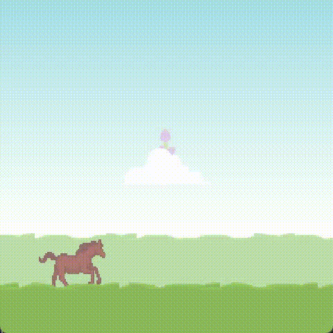

# horsing around

the source code for the game https://heritonaru.itch.io/horsing-around 

made for [Mini Jam 205: Horses](https://itch.io/jam/mini-jam-205-horses)



this project was named thorbox because I originally planned to use thorvg and box2d, but I scrapped that idea midway because I felt like I will encounter a problem during distribution for the game jam above.

## repl dev

need jdk25, clojure
```sh
clojure -T:lets repl
```

# make small runtime

```sh
clojure -T:lets jlink
```

## release

```sh 
clojure -T:lets release
clojure -T:lets play
```
